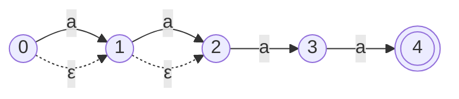
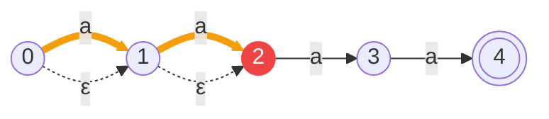
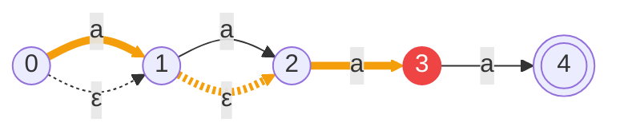
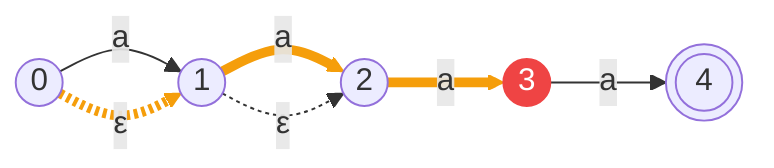
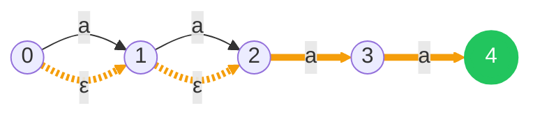
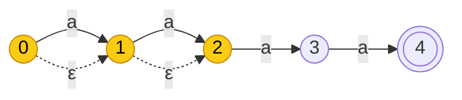
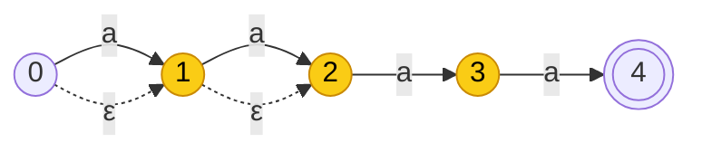
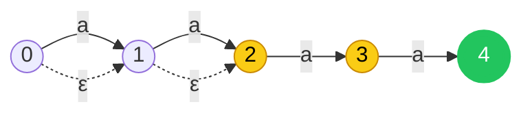

# When regex goes wrong

<div v-click="1">

#### Stack Overflow, 20 July 2016

A whitespace-trimming regex, `^[\s\u200c]+|[\s\u200c]+$`, hit a post with ~20,000 spaces in a row. Every render of the home page took 199,990,000 character checks, and the site was down for **34 minutes**.

</div>

<div v-click="2">

#### Cloudflare, 2 July 2019

One new firewall rule contained `.*(?:.*=.*)`. CPUs hit nearly 100% across their network, every Cloudflare site returned 502 errors, and the service was down for **27 minutes**.

</div>

<h3 v-click="3">How does one line of regex take down a website?</h3>

---

## Timing Example
#### `^(a+)+$` against `aaa…a!` (n a's), which can never match

```bash
time python3 -c 'import re; re.search(r"^(a+)+$", "a"*24 + "!")'
time perl -e '("a" x 24 . "!") =~ /^(a+)+$/'
time rg '^(a+)+$' <<< "$(printf 'a%.0s' {1..24})!"
```
| n | Python | Perl | ripgrep |
| --- | --- | --- | --- |
| <span v-click="1">16</span> | <span v-click="1">2.2 ms</span> | <span v-click="1">&lt; 0.1 ms</span> | <span v-click="1">&lt; 10 ms</span> |
| <span v-click="2">26</span> | <span v-click="2">1.91 s</span> | <span v-click="2">&lt; 0.1 ms</span> | <span v-click="2">&lt; 10 ms</span> |
| <span v-click="3">10,000</span> | <span v-click="3">not attempted</span> | <span v-click="3">300 ms</span> | <span v-click="3">&lt; 10 ms</span> |
| <span v-click="4">30,000</span> | <span v-click="4">not attempted</span> | <span v-click="4">2.72 s</span> | <span v-click="4">&lt; 10 ms</span> |

<p v-click="5" style="color: #888888">
Python and Perl both backtrack, but Perl spots this pattern and caches work it has already done. Not all implementations are equal, but the cache only turns exponential into quadratic: 10× the input, 100× the time.
</p>

---

# ...but Perl isn't safe either

#### `^(?:a?){n}a{n}$` against `aaa…a` (n a's), which should match

```bash
time python3 -c 'import re; n=24; re.search(r"^(?:a?){%d}a{%d}$" % (n, n), "a"*n)'
time perl -e '$n=24; ("a" x $n) =~ /^(?:a?){$n}a{$n}$/'
time rg '^(?:a?){24}a{24}$' <<< "$(printf 'a%.0s' {1..24})"
```

| n | Python | Perl | ripgrep |
| --- | --- | --- | --- |
| <span v-click="1">16</span> | <span v-click="1">1.4 ms</span> | <span v-click="1">4.5 ms</span> | <span v-click="1">&lt; 10 ms</span> |
| <span v-click="2">20</span> | <span v-click="2">22 ms</span> | <span v-click="2">74 ms</span> | <span v-click="2">&lt; 10 ms</span> |
| <span v-click="3">24</span> | <span v-click="3">349 ms</span> | <span v-click="3">1.16 s</span> | <span v-click="3">&lt; 10 ms</span> |
| <span v-click="4">26</span> | <span v-click="4">1.36 s</span> | <span v-click="4">4.76 s</span> | <span v-click="4">&lt; 10 ms</span> |

<p v-click="5" style="color: #888888">
No cache catches this one: every 2 extra a's makes both backtracking engines take ~4× longer. Only the automaton engine stays flat.
</p>

---

# Why does it blow up?

#### Shrink the second demo to n = 2: `a?a?aa` against `aa`

<v-switch>
<template #0>



<div class="text-2xl mt-6">

Every `a?` is a fork: **consume** an `a`, or **skip** (ε). A backtracking engine follows **one path at a time**.

</div>

</template>
<template #1>



<div class="text-2xl mt-6">

**Try 1:** consume, consume. Out of input at state 2 ✗ back up

</div>

</template>
<template #2>



<div class="text-2xl mt-6">

**Try 2:** consume, skip. Out of input at state 3 ✗ back up

</div>

</template>
<template #3>



<div class="text-2xl mt-6">

**Try 3:** skip, consume. Out of input at state 3 ✗ back up

</div>

</template>
<template #4>



<div class="text-2xl mt-6">

**Try 4:** skip, skip. Reaches state 4 ✓ match

</div>

</template>
<template #5>


<div class="text-2xl mt-6">

Greedy tries "consume" first, so the one path that works is the **last** one. n forks means 2<sup>n</sup> paths: at n = 26 that's 67 million.

<p style="color: #888888">
<code>^(a+)+$</code> is the same story: the nested <code>+</code> can split n a's 2<sup>n−1</sup> ways, and the <code>!</code> makes every split fail.
</p>

</div>

</template>
</v-switch>

---

# How does ripgrep avoid it?

#### Same NFA, but follow **every** path at once

<v-switch>
<template #0>


<div class="text-2xl mt-6">

Instead of picking one path, keep the **set** of states we could be in.

</div>

</template>
<template #1>



<div class="text-2xl mt-6">

**Start:** &#123;0, 1, 2&#125;. ε lets us skip either `a?`

</div>

</template>
<template #2>



<div class="text-2xl mt-6">

**Read `a`:** &#123;1, 2, 3&#125;. Every state moves forward on `a`

</div>

</template>
<template #3>



<div class="text-2xl mt-6">

**Read `a`:** &#123;2, 3, 4&#125;. State 4 is accepting ✓ match

</div>

</template>
<template #4>


<div class="text-2xl mt-6">

This is the NFA → DFA subset construction, done on the fly. Each character is read **once** and updates at most m states: O(m·n). At n = 26 that's 26 steps over at most 53 states, not 67 million paths.

</div>

</template>
</v-switch>

---

# What does it cost?

#### m = length of the regex, n = length of the input

| Engine | Used by | Matching time |
| --- | --- | --- |
| <span v-click="1">DFA</span> | <span v-click="1">grep, RE2, Rust (built lazily)</span> | <span v-click="1">O(n), but building it can take O(2<sup>m</sup>) states</span> |
| <span v-click="2">NFA simulation</span> | <span v-click="2">RE2, Go, Rust, ripgrep</span> | <span v-click="2">O(m·n), guaranteed</span> |
| <span v-click="3">Backtracking</span> | <span v-click="3">PCRE2, Perl, Python, JS, Java</span> | <span v-click="3">O(2<sup>n</sup>), Worst case</span> |

---
clicks: 11
---

# So why not always use a linear engine?

#### Some features only work with backtracking. Which bucket does each one go in?

<SortBuckets :step="$clicks" fast-label="Works in linear-time engines (Go, Rust, ripgrep)" slow-label="Needs a backtracking engine" :items="[
  { label: 'literals', example: 'cat', bucket: 'fast' },
  { label: 'alternation', example: 'cat|dog', bucket: 'fast' },
  { label: 'recursion', example: '(?R)', bucket: 'slow', note: 'nested ( ) need unlimited counting: more than a finite automaton can do' },
  { label: 'backreferences', example: '(\\w+) \\1', bucket: 'slow', note: 'must remember the exact text a group matched: more than a finite automaton can store' },
  { label: 'anchors', example: '^ $ \\b', bucket: 'fast' },
  { label: 'lazy quantifiers', example: 'a*? a+?', bucket: 'fast', note: 'only changes which match is reported' },
  { label: 'character classes', example: '\\d [a-z] .', bucket: 'fast' },
  { label: 'quantifiers', example: 'a* a+ a{2,4}', bucket: 'fast', note: '{n,m} is copied out, so big counts grow the automaton' },
  { label: 'capture groups', example: '(\\d+)', bucket: 'fast', },
  { label: 'lookarounds', example: '(?=\\d)', bucket: 'slow', note: 'possible in theory, but mainstream linear engines do not support them yet' },
]" />

<p v-click="11" style="color: #888888">
Both demo patterns only use left-bucket features, and they still blew up. The engine decides the speed; these features decide which engine you can use.
</p>
